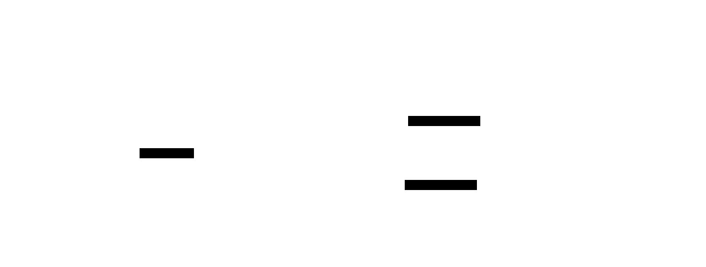

# Lab 12: Amazon SNS (Simple Notification Service)

## Objective
Build a **pub/sub fan-out architecture** using Amazon SNS. A single publisher sends one message to an SNS topic, which simultaneously delivers it to all subscribers — in this lab, an SQS queue (fan-out leg A) and an optional email endpoint (fan-out leg B). This pattern is the foundation of event-driven, loosely-coupled AWS architectures.

## Architecture

## Key Concepts

### 1. SNS vs. SQS — Choosing the Right Tool
* **SNS (Push / Pub-Sub):** One message is broadcast to **all** subscribers simultaneously. SNS does **not** retain messages — if a subscriber is unavailable, the message is lost unless an SQS buffer is in place.
* **SQS (Pull / Queue):** One message is delivered to **one** consumer. Messages are retained for up to 14 days.
* **Rule of thumb:** Need to notify many services at once? → **SNS**. Need to queue work for one worker? → **SQS**. Need both? → **SNS + SQS Fan-Out** (this lab).

### 2. Fan-Out Pattern
Publish **once** to an SNS topic; SNS delivers to **all** subscriptions in parallel. This decouples publishers from consumers: adding a new subscriber requires zero changes to the publisher.

### 3. Subscription Protocols
SNS supports multiple delivery protocols per topic:

| Protocol | Use Case |
|---|---|
| `sqs` | Async fan-out to an SQS queue (most common) |
| `lambda` | Serverless processing triggered by the event |
| `https` | Webhook delivery to an HTTP endpoint |
| `email` | Human-readable notifications |
| `sms` | Text message alerts |

### 4. SQS Queue Policy (Required for SNS → SQS)
For SNS to deliver to an SQS queue, the **queue must grant `sqs:SendMessage`** to `sns.amazonaws.com` via a resource-based policy. Without this, messages are silently dropped. A `Condition: ArnEquals` restricts the grant to only your specific topic — a security best practice.

### 5. SNS Message Envelope
When `raw_message_delivery = false` (default), SNS wraps your payload in a JSON envelope containing `MessageId`, `TopicArn`, `Timestamp`, and the original message as the `"Message"` field. Set `raw_message_delivery = true` to strip the wrapper and deliver the raw payload directly.

---

## Implementation Details
* **SNS Topic:** `lab-orders` (Standard)
* **SQS Subscription (Leg A):** `lab-standard-queue` — `raw_message_delivery = false`
* **Email Subscription (Leg B):** Optional — set `sns_email_endpoint` variable (requires manual inbox confirmation)
* **SQS Queue Policy:** `AllowSNSToSendMessage` with `ArnEquals` condition on `lab-orders`

---

## SAA Exam Takeaways
* **Fan-out = SNS + multiple SQS queues** — the canonical event-driven decoupling pattern for the SAA exam.
* **SQS queue policy must explicitly allow `sns:SendMessage`** from `sns.amazonaws.com`. This is a common exam trap.
* **SNS does not persist messages** — always pair with SQS when durability is required.
* **FIFO SNS → FIFO SQS only** — Standard SNS topics cannot subscribe to FIFO SQS queues.
* **Message filtering** — SNS subscriptions support filter policies on message attributes to reduce unnecessary processing by downstream subscribers.
* **Email/SMS subscriptions require manual confirmation** before becoming active; they start in `PendingConfirmation` status.
